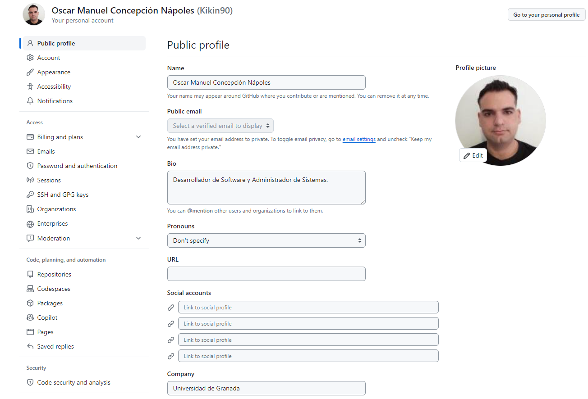
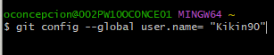
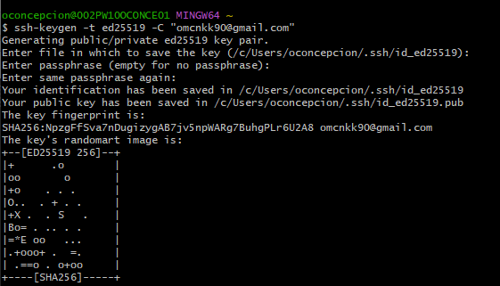
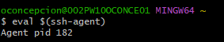
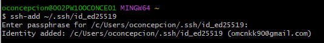
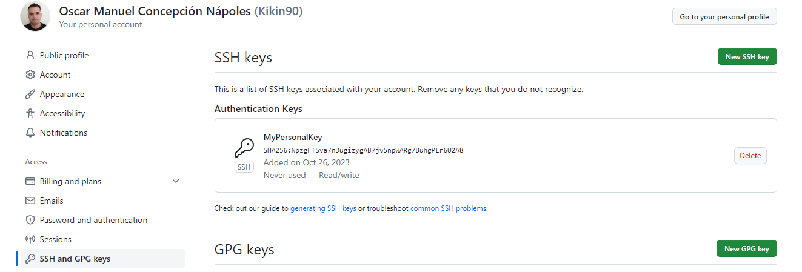

# Hito 1
    LibroWave Version 0.1
## Configuración de GitHub y Git.
En este apartado se explica la configuración de la cuenta en GitHub  y  en Git.
Se crea la cuenta con todos los datos disponibles (Nombre, Correo, Foto ...)

Configuración de nombre y correo en Git

Crear la llave privada y pública para subirla a GitHub.

Se crean las llaves con el comando:

Se activa el Agente SSH con el comando:

Se le pasa la clave al Agente SSH con el comando:

Se sube la clave publica a GitHub.

