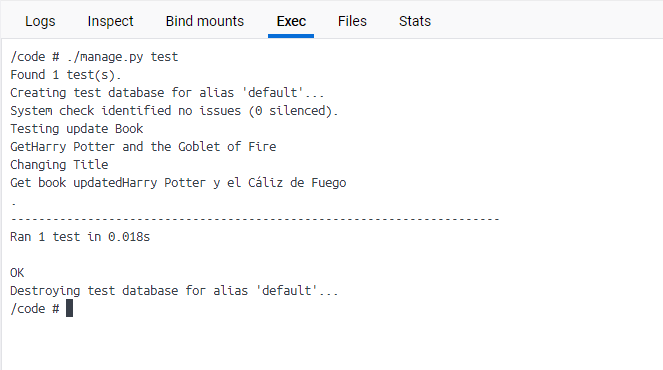

# Hito #2

LibroWave Version 2.1

## Contenido de este Hito
A medida que crecen los sitios web se vuelven más difíciles de probar a mano — no sólo hay más para probar, sino que además, a medida que las interacciones entre los componentes se vuelven más complejas, un pequeño cambio en un área puede suponer muchas pruebas adicionales para verificar su impacto en otras áreas. Una forma de mitigar estos problemas es escribir tests automatizados, que pueden ser ejecutados de manera fácil y fiable cada vez que hagas un cambio.

En este Hito si realizan los test al proyecto, LibroWave, desarrollado con el framework Django.
Las pruebas unitarias de Django utilizan un módulo de biblioteca estándar de Python: unittest. Este módulo define pruebas utilizando un enfoque basado en clases.


Una vez que haya escrito las pruebas, se ejecutan usando el testcomando de la utilidad del proyecto manage.py:

```python
$ ./manage.py test
```
A continuación se muestra el código del test de crear Libro y obtener el Libro según su *Nombre*:


Ejemplo de Ejecución del Test correctamente:


Código del test obtener el Libro según su *Nombre* pero con ERROR. 


Ejemplo de Ejecución del Test:


Para finalizar el Hito se muestra el código del test de Actualizar el Libro y obtenerlo actualizado.


Ejemplo de Ejecución del Test:

