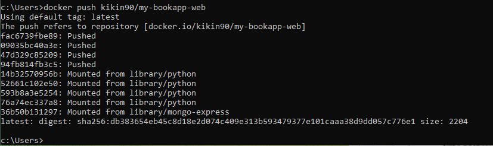
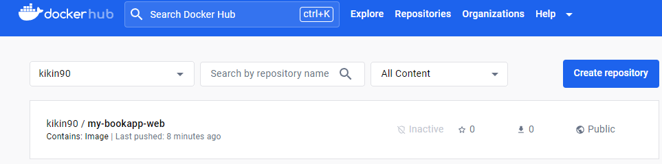

# Hito #3

LibroWave Version 2.2

## Contenido de este Hito

En este hito se creará el contenedor en Docker encargado de los Test de la aplicación a desarrollar, ya implementados en el hito anterior.
Se actualizará y subirá la imagen a DockerHub, se utilizará para alojar el contendor de test del proyecto, actualizando la imagen de manera automática a través de un Workflow.
Se utilizará GitHub Container Registry para almacenar imágenes de contenedores dentro de nuestra cuenta de GitHub y permitir asociar una imagen a un repositorio.


## Selección del Contenedor

En el caso de este proyecto que es desarrollado en Python, se selecciona simplemente una imagen oficial de python, no es necesario una imagen de algun sistema Operativo, para luego instalar Python en él.
Se selecciona la Imagen de python con su version alpine (es mas lijera) en su version 3.17: python:alpine3.17
Se establece un directorio de trabajo específico, en este caso en: /code
Se copia el fichero requirements.txt para el workdir /code: COPY requirements.txt /code/
Se instalan todas las aplicaciones del fichero requirements, en este caso Django que es un framework Web que ya tiene incluido su propio Test: RUN pip install -r requirements.txt
Al finalizar se copia toda la info necesario del directorio actual al del Contenedor: COPY . /code/
Al finalizar el fichero DockerFile queda de la siguiente forma:

### Fichero Dockerfile 

```

FROM python:alpine3.17
WORKDIR /code
COPY requirements.txt /code/
RUN pip install -r requirements.txt
COPY . /code/

```
## Creación del Contenedor

Se abre un consola CMD y se se ejecuta los comandos

```
docker-compose build
```

y

```
docker-compose up
```

que descargará e instalará todo lo necesario en el contenedor.

## Subida de la Imagen a DockerHub

Una vez finalizado se sube la imagen a DockerHub con el comando



Se comprueba y ya esta la imagen en DockerHub:



## Uso de GitHub Container Registry 

Con GitHub Container Registry almacenamos imágenes de contenedores dentro de nuestra cuenta de GitHub. En este caso se utiliza para almacenar la imagen my-bookapp-web. El desplieque del contenedor se puede ver [aquí](../workflows/update_image.yml).


