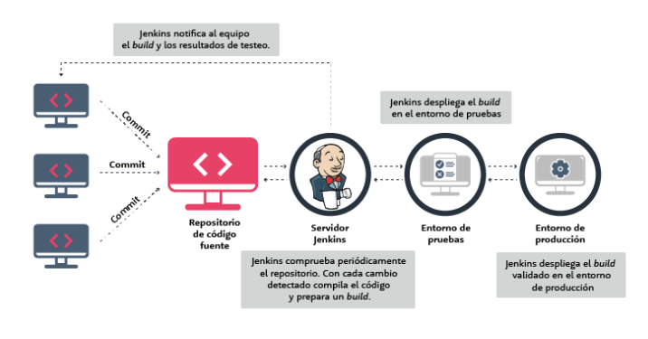
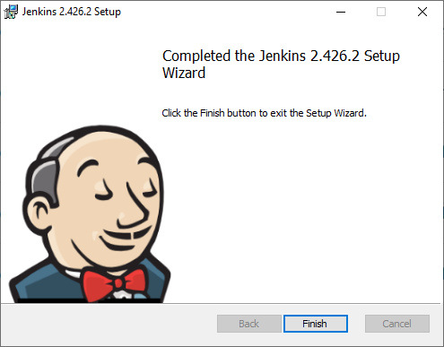
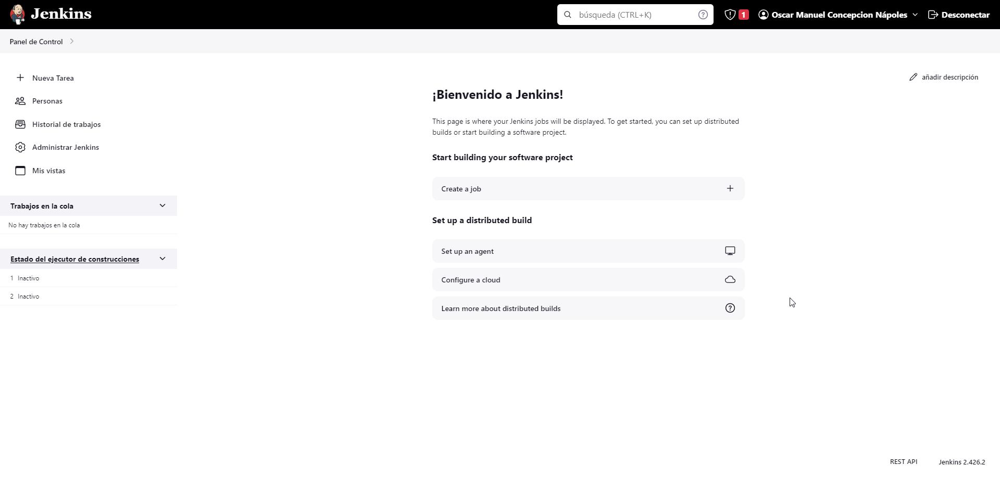
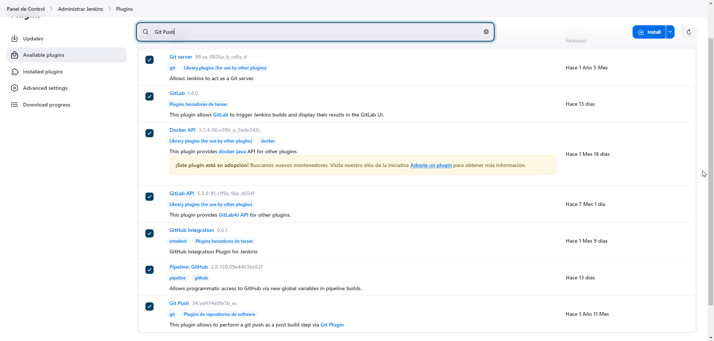
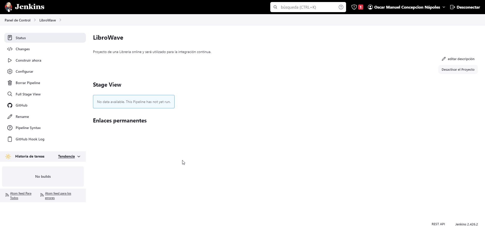
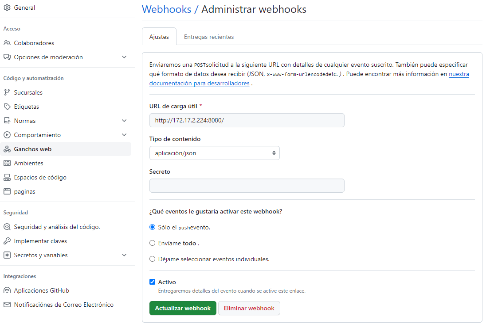
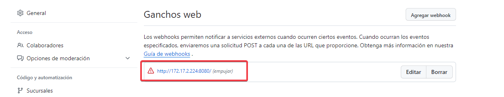

# Hito #4

LibroWave Version 2.3

## Contenido de este Hito

+   Integración Continua (IC) , Jenkins como sistema de IC y sus respectivas configuraciones.

+   Configuración de Jenkins.

+   Configuración de GitHub Actions.

## Elección del sistema de Integración Continua

El objetivo de este hito es preparar el proyecto para la integración continua. Para esto se han valorado diferentes alternativas de las que se selecciono Jerkins.
Jenkins es un servidor open source para la integración continua. Es una herramienta que se utiliza para compilar y probar proyectos de software de forma continua, lo que facilita a los desarrolladores integrar cambios en un proyecto y entregar nuevas versiones a los usuarios. Escrito en Java, es multiplataforma y accesible mediante interfaz web. Es el software más utilizado en la actualidad para este propósito.

Con Jenkins, las organizaciones aceleran el proceso de desarrollo y entrega de software a través de la automatización. Mediante sus centenares de plugins, se puede implementar en diferentes etapas del ciclo de vida del desarrollo, como la compilación, la documentación, el testeo o el despliegue.

Con Jenkins la integración continua facilita:

* Cada commit es desarrollado y verificado. Con lo que en lugar de comprobar todo el código, los desarrolladores sólo necesitan centrarse en un commit concreto para corregir bugs. 
* Los desarrolladores conocen los resultados de las pruebas de sus cambios durante la ejecución.
* Jenkins automatiza el despliegue y las pruebas, lo que ahorra mucho tiempo y evita errores.
* El ciclo de desarrollo es más rápido. Se entregan más funcionalidades y más frecuentemente a los usuarios, con lo que los beneficios son mayores.

## Configuración de Jenkins

Una vez instalado Jenkins y creada la cuenta se  Administra Jenkins

Se instalan los diferentes plugins necesarios para la integración con GitHub y Docker.

Se crea el proyecto LibroWave en Jenkins.

A la hora de enlazar github con jenkins con los Webhooks da error porque Jenkins tiene que estar Online en una IP pública, se muestran imagenes del error de conexion. !

Se buscaron varios programas para hacer publica la IP de mi ordenador, pero eran de pago o de codigo abierto como por ejemplo ngrok, pero estos softwares lo que hacen es abrir un tunnel o puerta trasera para que se pueda acceder desde internet, esto por políticas de empresa me es imposible ejecutarlo en mi ordenador.
Por tanto se decide  seguir con el Hito sin realizar la integracion completa.

Una vez supuestamente integrado Jenkins con mi repositorio en Github se crea un fichero Jenkinsfile que es en donde estara  programado todos los jobs, incluido la conexión a mi repositorio de Dockerhub.  Y se realizaran los jobs de test al realizar las GithubActions. 
