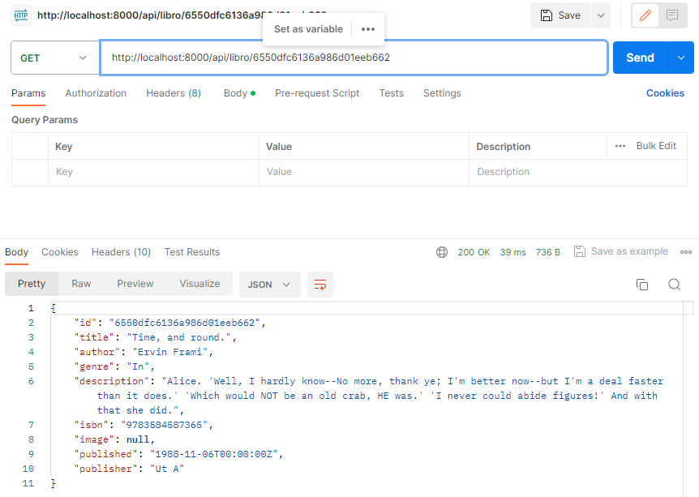
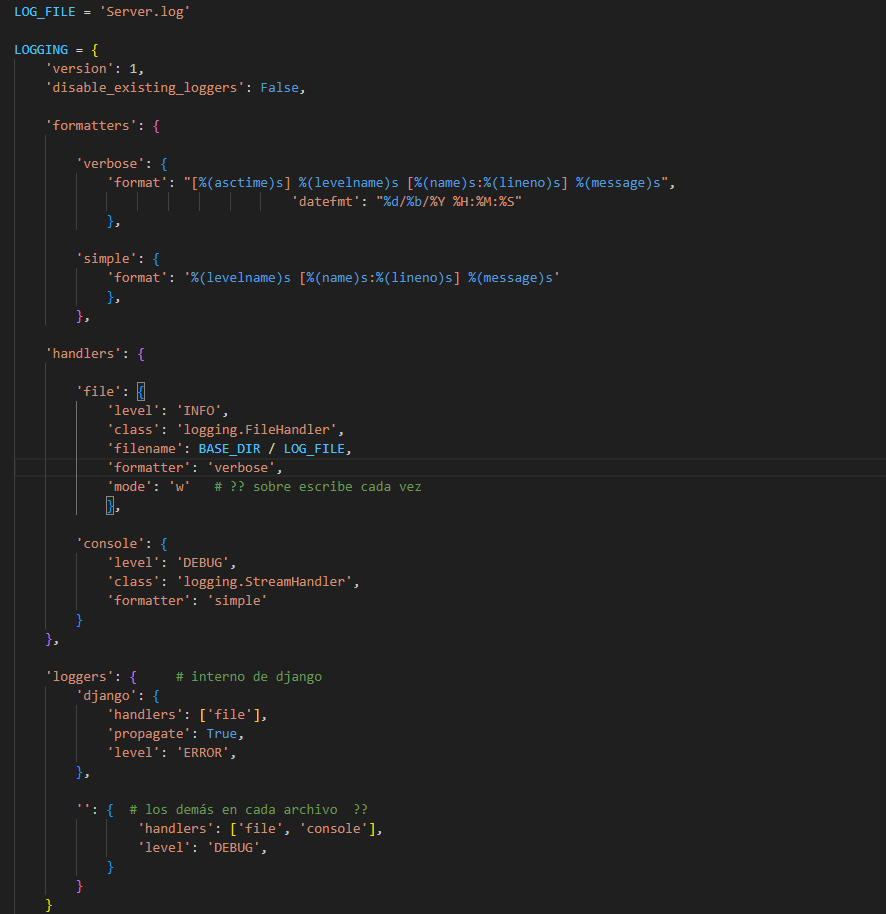

# Hito #5

LibroWave Version 2.4

## Contenido de este Hito

+   Selección del framework para el desarrollo del sistema.

+   Diseño de la API.

+   Control de logs del servicio API.

+   Estructura del Sistema con 3 servicios.   


## Selección del framework para el desarrollo del sistema.

Como framework se ha seleccionado Django que es un framework de desarrollo web de código abierto, escrito en Python, respeta el patrón de diseño conocido como modelo–vista–controlador (MVC). 
La meta fundamental de Django es facilitar la creación de sitios web complejos. Django pone énfasis en el re-uso, la conectividad y extensibilidad de componentes, el desarrollo rápido y el principio «DRY» (del inglés Don't Repeat Yourself,«No te repitas»). El lenguaje Python es usado en todos los componentes del framework, incluso en configuraciones, archivos,1​ y en sus modelos de datos.

Dentro de las características de Django estan:

+ Un mapeador objeto-relacional.
+ Aplicaciones "enchufables" que pueden instalarse en cualquier página gestionada con Django.
+ Una API de base de datos robusta.
+ Un sistema incorporado de "vistas genéricas" que ahorra tener que escribir la lógica de ciertas tareas comunes.
+ Un sistema extensible de plantillas basado en etiquetas, con herencia de plantillas.
+ Un despachador de URLs basado en expresiones regulares.
+ Un sistema "middleware" para desarrollar características adicionales; por ejemplo, la distribución principal de Django incluye componentes middleware que proporcionan cacheo, compresión de la salida, normalización de URLs, protección CSRF y soporte de sesiones.
+ Soporte de internacionalización, incluyendo traducciones incorporadas de la interfaz de administración.
+ Documentación incorporada accesible a través de la aplicación administrativa (incluyendo documentación generada automáticamente de los modelos y las bibliotecas de plantillas añadidas por las aplicaciones).


## Diseño de la API.

Como se menciona en la seccion anterior la API ha sido desarrollada utilizando el framework Django, a continuación se muestra un ejemplo del codigo de la API creado es el siguiente:

```
class Libro(APIView):
    def get(self,request,pk):
        libro=self.get_libro_or_error(pk)
        serializador=SerializerLibro(libro)
        return Response(serializador.data)
    
    def get_libro_or_error(self, pk):
        try:
            return Book.objects.get(id=pk)
        except:
            return Response({
                'error':'El libro no se encuentra'
            },status=status.HTTP_404_NOT_FOUND)

    def put(self,request,pk):
        libro=self.get_libro_or_error(pk)    
        serializer=SerializerLibro(libro)
        return Response(serializer.data)
    
    def delete(self, request,pk):
        libro=self.get_libro_or_error(pk)
        libro.delete()
        return Response(status=status.HTTP_204_NO_CONTENT)

```

A continuación se muestra un ejemplo del uso de la API en la WEB y el resultado en Postman.




## Control de logs del servicio API.

Para el control de logs Django utiliza y amplía el módulo de registro integrado de Python para realizar el registro del sistema.
Una configuración de registro de Python consta de cuatro partes:

+ Registradores
+ Manipuladores
+ Filtros
+ Formateadores

Python define los siguientes niveles de registro:

+ DEBUG: información del sistema de bajo nivel para fines de depuración
+ INFORMACIÓN: Información general del sistema
+ ADVERTENCIA: Información que describe un problema menor que ha ocurrido.
+ ERROR: Información que describe un problema importante que ha ocurrido.
+ CRÍTICO: Información que describe un problema crítico que ha ocurrido.

A continuación se muestra ejemplo del uso de Logger en la API guardados en el fichero Server.log:



## Estructura del Sistema con 3 servicios.

El sistema esta desplegado con uso de 3 servicios: 

+ Sistema Web con Django. (Port: 8000)
+ Base de Datos con MongoDB. (Port: 27017)
+ Web de gestion de la BD MongoExpress. (Port: 8081)

