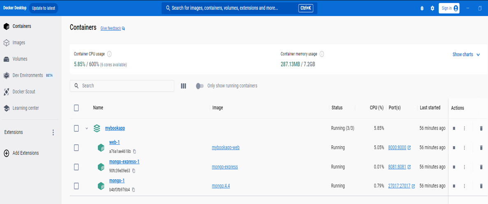

# Hito #5

LibroWave Version 2.5

## Contenido de este Hito

+   Estructura del fichero docker-compose.yml

+   Despliegue del proyecto con los servicios en Funcionamiento en contenedores.
 

## Estructura del fichero docker-compose.yml

A continuación se muestra el archivo docker-compose.yml que orquesta y construye la aplicación. De esta manera, se detallará los servicios desplegados tal y como se puede observar (Servicios Web, Mongo y Mongo-Express):

```
services:
  web:
    build: .
    command: python manage.py runserver 0.0.0.0:8000
    volumes:
      - .:/code
    ports:
      - 8000:8000
    depends_on:
      - mongo

  mongo:
    image: mongo:4.4
    ports: 
      - 27017:27017
    volumes:
      - ./datos_db:/data/db

  mongo-express:
    image: mongo-express
    ports:
      - 8081:8081
    depends_on: 
      - mongo
```

## Despliegue del proyecto con los servicios en Funcionamiento en contenedores.
Una vez levantados los servicios con el comando 

```
docker docker-compose.yml up

```

Se ve como el contenedor esta activo con los servicios en funcionamiento en el Docker Desktop.



Se puede observar el uso de CPU de los contenedores, los puertos por los que escuchan, tanto la PC como los servicios en el contenedor.

Aqui se puede ver la página web del sistema LibroWave en funcionamiento:

